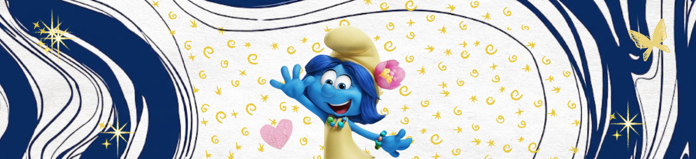

<h1> Hii, I'm Maham</h1>

## `About Me`
I'm a CS major at NUST, passionate about building projects that have a meaning. 

 

 

## `Projects`

<table>
  <tr>

<td width="50%" valign="top">

  <h3><a href="https://github.com/Maham-Codes/llm-decision-bias-benchmark">LLM Decision-Advisor Bias & Agent Benchmark</a></h3>

  
Built a benchmark to study <b>framing sensitivity in LLM-based decision making</b>, evaluating whether economically identical prompts produce different recommendations. Implemented structured LLM outputs with Pydantic, statistical invariance metrics, ANOVA, and a multi-agent second-opinion protocol.

  
  
  
  

</td>

<td width="50%" valign="top">

  <h3><a href="https://github.com/Maham-Codes/ICASSP-Cadenza-Challenge-Predicting-Lyric-Intelligibility-CLIP1">Cadenza — Lyric Intelligibility Modeling</a></h3>

  
Developed a multi-stage ML pipeline for predicting <b>human-rated lyric intelligibility</b> from audio. Compared classical and learned baselines including STOI, Whisper, CNN+MFCC, and Wav2Vec2, then improved the Whisper approach using vocal isolation and confidence-aware scoring.

  
  
  
  

</td>

  </tr>

  <tr>

<td width="50%" valign="top">

  <h3><a href="https://github.com/Maham-Codes/sustainable-recommendation-system">Sustainability-Aware Recommender System</a></h3>

  
Built a <b>collaborative filtering recommender</b> that re-ranks personalized recommendations using a sustainability signal derived from product metadata. Designed a tunable relevance–sustainability trade-off and evaluated ranking quality across different weighting strategies.

  
  
  
  

</td>

<td width="50%" valign="top">

  <h3><a href="https://github.com/Maham-Codes/AI-based-Intrusion-Detection-Prevention-System-IDPS">AI-Powered Intrusion Detection & Prevention</a></h3>

  
Developed an <b>ML-based intrusion detection system</b> trained on KDDCup99/NSL-KDD data to classify network attacks across five categories. Added preprocessing, attack severity scoring, automated IP blacklisting, alert logging, and a Flask monitoring dashboard.

  
  
  
  

</td>

  </tr>

  <tr>

<td width="50%" valign="top">

  <h3><a href="https://github.com/Maham-Codes/ai-based-web-application-firewall">AI-Based Web Application Firewall</a></h3>

  
Built a hybrid <b>rule-based + machine learning WAF</b> using TF-IDF and Logistic Regression to detect malicious HTTP requests including SQL injection, XSS, command injection, and path traversal across 60K+ balanced samples.

  
  
  
  

</td>

<td width="50%" valign="top">

  <h3><a href="https://github.com/Maham-Codes/SustainaBite-Food-Waste-Management-System">SustainaBite — Food Waste Management System</a></h3>

  
Developed a full-stack platform addressing <b>food waste and redistribution</b>, implementing user authentication, donation workflows, real-time communication, cloud media handling, and email notifications through a MERN-based architecture.

  
  
  
  

</td>

  </tr>
</table>

 

## `Stack`

